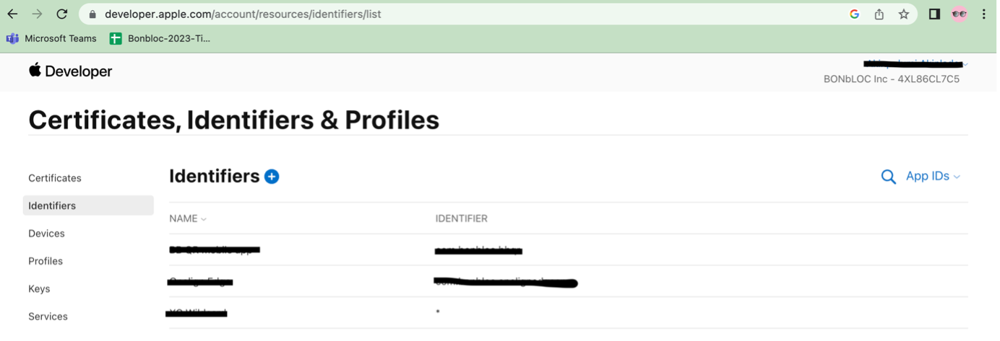

# Publishing your App to Apple Store

Prerequisites

- Make sure that you've covered Apple's guidelines for releasing an app on the app store.
- Have your app's icons and launch screens ready.
- Ensure you have a MacBook
- Ensure XCODE is running on your PC correctly
- Have an Apple Developer account.

Prepare for building

Before you can build and release your app on the App Store, you need to set up a place for it using App Store Connect. But first, you need to register a unique bundle ID for your app. This can be done by logging into your Apple Developer account and following these steps:

- Open the  **App IDs**  page (Go to=[https://developer.apple.com/account/resources/](https://developer.apple.com/account/resources/))
- Click  **+**  to create a new  **Bundle ID** and select **App ID** as option.
- 
- Fill out the needed information:  **App Name** , and  **Explicit App ID**  (note that this must be the same with your app bundle identifier in the source code).
- If your app needs specific services, select them and click  **Continue**.
- Review the details and click  **Register**  to finish.
- Follow the instructions [**HERE**](https://developer.apple.com/help/account/create-certificates/create-developer-id-certificates)to create **Certificates** and [**HERE**](https://developer.apple.com/help/account/register-devices/register-a-single-device/)to register your test device.
 Now that we have a unique bundle ID, it's time to set up a place for your app on the App Store Connect. Log in to the App Store Connect here ([https://appstoreconnect.apple.com/](https://appstoreconnect.apple.com/)).
- Select  **My Apps**.
- 
- Click  **+**  then select  **New App**.
- 
- Fill in your app details and make sure  **iOS**  is selected, then click  **Create**.
- 
- Now we are talking about the name that will show up on the App Store. Select the primary language in which the app display its content and select the Bundle ID. Notice that you can't input the Bundle ID, you must select one of the Bundle ID's from your App ID's list. We did this earlier in this article! If it doesn't appear wait a bit, sometimes it takes a couple minutes from creating the App ID to appearing on App Store Connect.
- SKU stands for Stock Keeping Unit, which is nothing more than a unique identifier for your app. Doesn't really make any difference to use something completely unrelated or not, but it must be unique. Why don't we go for: country.mycompany.myappname? Seems pretty differentiable.
- From the sidebar, select  **App Information**.
- In the General Information section, select the  **Bundle ID**  that you registered above.

Adjust Xcode project settings for release

You've set everything up from Apple's side, and next you'll adjust your Xcode project's settings to prepare your app for release. Go ahead and fire up Xcode.

- Open  **Runner.xcworkspace**  (Right click and select open with  **XCode** ) that is inside your app's  **iOS**  folder (open your project in  **VS Code**  and locate  **iOS**  folder).
- 
- From the Xcode project navigator (inside your XCode), select the  **Runner**  project.
- Then, select the  **Runner target**  in the main view sidebar.
- Go to the  **General**  tab.
- 
- In the  **Identity**  section, fill out the information and make sure the  **Bundle Identifier**  is the one registered on App Store Connect ( **See above image** ).
- In the  **Signing**  section, make sure  **Automatically manage signing**  is checked and select your  **team**.
- 
- Fill out the rest of the information as needed.
- Next, you'll update your app's icon. This can be done by selecting  **Assets.xcassets**  in the Runner folder from Xcode's project navigator. (There are several ways to add app icon: you can use an sdk with **flutter\_launcher\_icon** or follow this instruction [**HERE**](https://developer.apple.com/documentation/xcode/configuring-your-app-icon))

Prepare your .IPA archive file from Xcode

- On the simulator list there's an option called ' **Generic iOS device'** , select this one and go for ' **Product'** on the tab bar and select ' **Archive'**. This will generate an **.ipa** (iOS package application — like APK on Android).

- Select **DISTRIBUTE APP** and proceed…

- On **Method of Distribution;** select " **App Store Connect**"

- On **Select Destination;** select " **Export**"
- 

Please note: "Runner" needs to be re-signed or signed for App Store Connect distribution. Select **automatic signing** options to continue. Then finalize export and save **IPA** file.

**Screenshots**

For me, that's the worst part of submitting an app. The App Store Connect checks your screenshots size if they are exactly the same size for each of the devices, if you have transparency on your image or not, and besides of this, there are loads of sizes you need to submit since it must be compatible with every device that matches your app configuration. An option would be to manually screenshot on each device and submit these. Another option would be to run the device on every each simulator and screenshot manually each one for every screen you want to submit.

However, There is an amazing open-source tool called Fastlane in which you can automatise the whole submission process. If you don't know this tool yet, you'll be astonished about how much time it can save you. Regarding the screenshot process, you can generate screenshots automatically via code for every device you want using Snapshot which is just one part of Fastlane. I might do an article soon talking about some really nice things we can do with Fastlane and it's magical plugins, but for now, read the docs if you want to integrate it to your app: [https://docs.fastlane.tools/getting-started/ios/screenshots/](https://docs.fastlane.tools/getting-started/ios/screenshots/)

- iOS App \> Version Information \> Support URL: It's not enough to put a URL to your landing page. The Apple team will visit the link and look for user support content (e.g. a contact form).

- **iOS App \> Build** : Here you will need to select the actual app file (.ipa format), but it's not possible to upload it directly to App Store Connect. You will need to use XCode or Transporter to upload the generated .ipa file. When the upload finishes you will find a new app version available in this section. You can see a list of all available versions in the TestFlight tab.

**Preferably, I enjoy using TRANSPORTER more**.

The new Transporter app for macOS makes it easy to upload your binary to App Store Connect. To get started, download Transporter from the Mac App Store, and simply drag and drop your binaries into the upload window. With Transporter you can:

- Upload your .ipa or .pkg files to App Store Connect.
- View delivery progress, including validation warnings, errors, and delivery logs, so you can quickly fix any issues.
- See a history of past deliveries, including date and time.

iOS App \> Age rating: You will be asked questions about the type of content in your app. There are no rights or wrongs. It's only about determining age restrictions for certain types of content. The Unrestricted Web Access item means whether users can access any URL inside your app (e.g. a web browser).

- **iOS App \> Review information** : If your app requires users to authenticate (e.g. creating an account or using an identity provider such as Facebook), you will need to provide demo credentials. Create a testing account in your app and add the username and password in this section.

- **App information \> Content rights** : Here you need to confirm that you don't use third-party content or, in case you do, that you are allowed to use such content. If you use a public API for example, you are allowed to use it given it's public.

- **Pricing and availability** : Apple let's you chose your app's price by selecting one of the 90+ price tiers at the time of writing (from free app to tier 87 app, i.e., 1099€). You can also choose the countries availability for your app in this section (by default your app will be available in all the countries of the world).

- **App Privacy \> Privacy policy** : It's mandatory to have a privacy policy in order to deploy an app to the app store. It will be visible on your app's page and it can either be a link to a PDF file or a web page. If you have already created a privacy policy page for you website you can link to that page (e.g. [https://www.bonbloc.com/privacy-policy](https://www.bonbloc.com/privacy-policy)).

- **App Privacy \> Privacy practices** : Questionnaire to determine whether your app collects and stores users data outside the application. If your app requires users to create an account for example, you are then storing user information outside the app. You will need to specify why you collect the data for each of the data types your app collects. Once you finish answering the privacy practices questionnaire, you will need to publish the answers to be able to submit your app for review.
- 
- 
- 
- 
- 
- 

**Submit for Review**

Congratulate yourself! You've made it through the App Store maze 🍾 You filled all the necessary sections and you've finally been allowed to submit your app for review. Over the next days Apple will take a look at your app and either approve it, getting back to you with the good news you are expecting, or reject it, providing a detailed explanation with the rejection reasons.